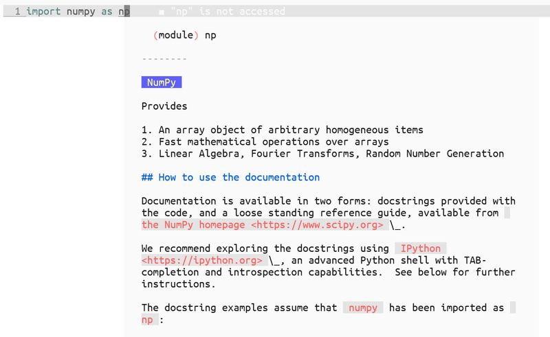
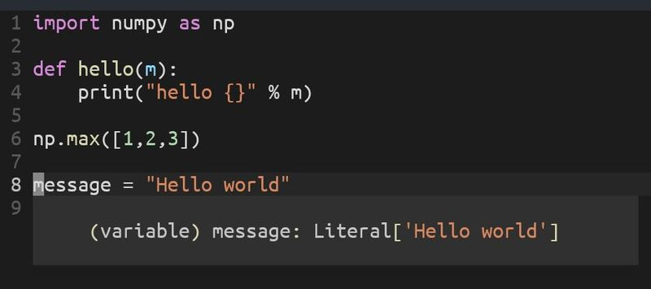

# glow-hover.nvim
Leverage [glow](https://github.com/charmbracelet/glow) to display LSP hover responses.

## Demo




## Install
This plugin relies on [glow](https://github.com/charmbracelet/glow). Make sure you have installed it.
```vim
Plug 'JASONews/glow-hover'
```

## Setup
```lua
lua << EOF
    require'glow-hover'.setup {
        -- The followings are the default values
        max_width = 50,
        padding = 10,
        border = 'shadow',
        glow_path = 'glow'
    }
EOF
```

## Limitation
This plugin only supports Neovim on Linux or MacOS.

## Acknowledgement
This plugin is inspired by [glow.nvim](https://github.com/ellisonleao/glow.nvim)
 and [neovim.lsp.util](https://github.com/neovim/neovim/blob/master/runtime/lua/vim/lsp/util.lua).
 Parts of code are copied from Neovim.lsp.util.
